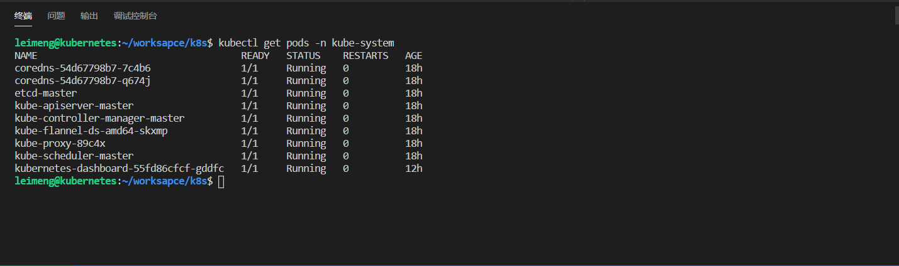

### Dashboard 安装遇坑
>[官方配置文件](https://raw.githubusercontent.com/kubernetes/dashboard/v1.10.1/src/deploy/recommended/kubernetes-dashboard.yaml)

>[阳明博客 安装Dashboard插件](https://www.qikqiak.com/k8s-book/docs/17.%E5%AE%89%E8%A3%85%20Dashboard%20%E6%8F%92%E4%BB%B6.html)

#### 1.镜像地址
官方的配置文件中dashboard镜像地址是
```k8s.gcr.io/kubernetes-dashboard-amd64:v1.10.1```，该地址镜像源是谷歌仓库，在国内是不能下载的，所以使用```mirrorgooglecontainers/kubernetes-dashboard-amd64:v1.10.1```,dockerhub上有谷歌仓库的
代理仓库，拉取下来后使用docker tag重新打标签,我这里是执行替换镜像文件的地址。

#### 2.证书
安装dashboard 成功


